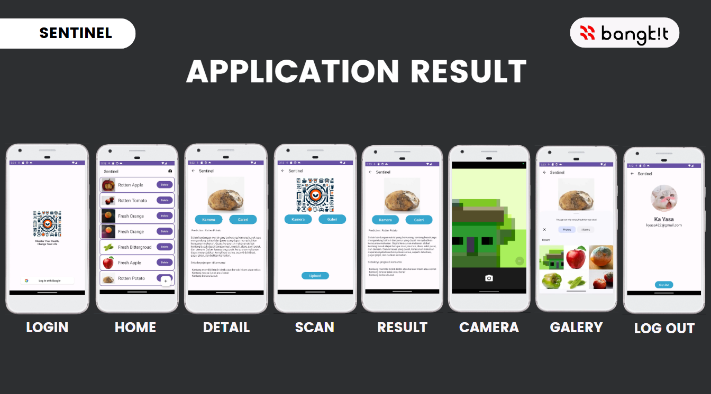

# SENTINEL ( Bangkit Capstone CH2-PS366 )
## Overview
SENTINEL is an android-based application that is intended to ensure food safety and promote community well-being through heightened awareness and responsible food safety practices. This application helps people monitor their food quality, especially for those with limited knowledge of food safety practices. SENTINEL provides features such as food ingredient detection. This feature not only informs users about the contamination status of a particular food ingredient but also delivers specific and tailored food safety practices associated with said identified ingredient. 

## Team Members 

| ID             | Name                           | University                  |
| -------------- | ------------------------------ | ---------------------------------|
| (ML) M128BSX1133 | Sarah Humaira                | Politeknik Negeri Jakarta       |
| (ML) M014BSY1296 | Kadek Dwitya Adhi Pradyto     | Universitas Udayana             |
| (ML) M494BSY0809 | Amalan Fadil Gaib             | Universitas Negeri Gorontalo    |
| (CC) C014BSY4256 | I Putu Diska Fortunawan       | Universitas Udayana             |
| (CC) C491BSY3453 | Raden Wahid Ikhsanudin        | Universitas Muhammadiyah Bandung|
| (MD) A128BSY2308 | Agus Setiawan                 | Politeknik Negeri Jakarta       |

